## basic01-xdp-pass
主要介绍了如何编写简单的xdp程序以及通过libbpf库或者iproute2将xdp程序加载到内核并将内核代码挂载到指定的网络接口上。
```bash
llvm-objdump -S xdp_pass_kern.o     # 查看汇编代码
```
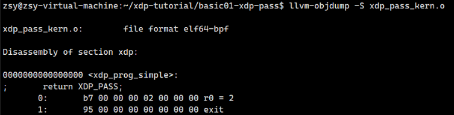
```bash
llvm-objdump -S --no-show-raw-insn xdp_pass_kern.o     # 查看汇编代码，不显示原始指令
```
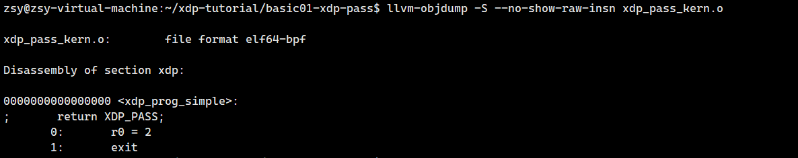
```bash
sudo ip link set dev lo xdpgeneric obj xdp_pass_kern.o sec xdp         # 将 xdp_pass_kern.o 中的 XDP 程序加载到 lo（回环接口）上，并指定该程序来自目标文件的 xdp 段
ip link show dev lo # 查看 设备接口状态
```
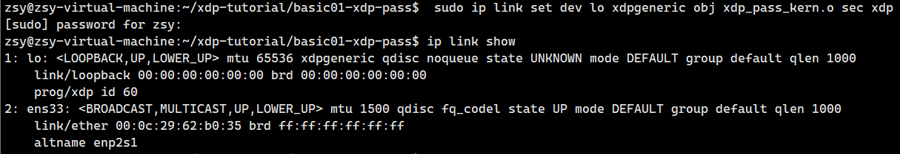
```bash
sudo ip link show dev lo     # 查看 XDP 程序是否加载成功
```

    1. 1: lo:表示网络接口的编号和名称。这里 1 是接口编号，lo 是接口名称，代表回环接口。
    2. <LOOPBACK,UP,LOWER_UP>这些是接口的状态标志：
        LOOPBACK：表示这是一个回环接口，用于本机通信。
        UP：接口处于启用状态。
        LOWER_UP：物理链路已被启用，这通常是指网络接口的硬件层面已经准备就绪，即使在回环接口这种虚拟接口上，这个标志也可以显示为 LOWER_UP。
    3. mtu 65536：MTU（Maximum Transmission Unit，最大传输单元）是指通过该接口能发送的最大数据包大小，
    单位为字节。lo 接口的默认 MTU 是 65536 字节。
    4. xdpgeneric：xdpgeneric 表示 XDP（eBPF）程序的使用。XDP（eXpress Data Path是 Linux 内核的一项技术，允许通过 eBPF（扩展的 BPF）进行高速数据包处理。这意味着回环接口上已经加载了一个 XDP 程序，用于优化网络数据包的处理。
    5. qdisc noqueue：qdisc 是队列规则的缩写，它控制着数据包的排队和调度。  
    noqueue 表示没有排队规则，这通常在不需要对数据包进行队列处理的接口上出现。
    6. state UNKNOWN：state 显示了接口的当前状态。UNKNOWN 表示接口的状态未知， 
    通常是因为这个接口是虚拟接口（回环接口），并没有像物理接口那样的明确状态。
    7. mode DEFAULT：mode 显示接口的工作模式。DEFAULT 表示回环接口处于默认工作模式。
    8. group default：group 是接口分组，default 表示这是一个默认的接口组。
    9. qlen 1000：qlen 表示接口的队列长度，1000 是队列的最大长度，表示最多可以排队 1000 个数据包。
    10. link/loopback 00:00:00:00:00:00 brd 00:00:00:00:00:00
    这行显示了接口的 MAC 地址（00:00:00:00:00:00）和广播地址。对于回环接口，MAC 地址通常会是全零。
    11. prog/xdp id 408 name xdp_prog_simple tag 3b185187f1855c4c jited
    这一行表示 XDP（eXpress Data Path）程序的信息：
    prog/xdp 表示该接口上加载了一个 XDP 程序。id 408 是程序的唯一标识符。
    name xdp_prog_simple 是该 XDP 程序的名称。
    tag 3b185187f1855c4c 是程序的标签，用于标识程序的哈希值。
    jited 表示该 XDP 程序已经经过 JIT（即时编译），并且已经在内核中编译为本地代码。
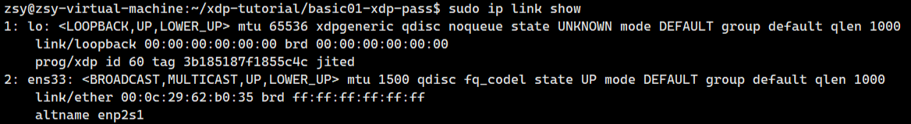
```bash
sudo ip link set dev lo xdpgeneric off # 关闭 XDP 程序
```
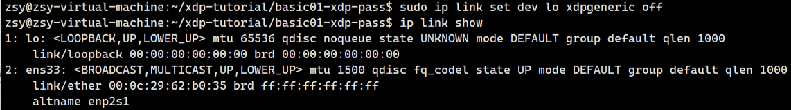
    
    XDP 支持不同的模式，如 drv（驱动模式）、skb（Socket Buffer 模式）、hw（硬件模式）。skb 模式通常用来在不直接修改网卡驱动的情况下，操作数据包。
    skb 模式表示 Socket Buffer 模式，也就是说 XDP 程序在内核的网络栈中处理网络数据包时，会在 Socket Buffer 层次进行处理。
    而 drv 模式表示驱动模式，也就是说 XDP 程序在内核的网络栈中处理网络数据包时，会直接调用网卡驱动进行处理。

```bash
sudo xdp-loader load -m skb load xdp_pass_kern.o     # 加载 XDP 程序
sudo xdp-loader status lo     # 查看 XDP 程序状态
```
    
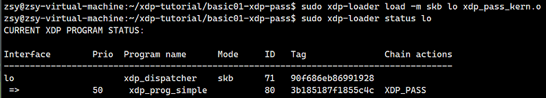

    这个输出提供了回环接口 (lo) 上的 XDP 程序的详细信息。
    Interface：显示了 XDP 程序加载的网络接口。在这个例子中是 lo，即回环接口。
    Prio：显示 XDP 程序的优先级。XDP 程序的优先级决定了它在处理数据包时的顺序。值越低，优先级越高。在此例中，优先级是 50，这表示该程序的优先级在链条中的位置。
    Program name：显示 XDP 程序的名称。在这里是 xdp_dispatcher，是加载到回环接口上的主 XDP 程序，可能是一个负责调度不同 XDP 处理逻辑的程序。
    Mode：显示 XDP 程序运行的模式。这里的模式是 skb，表示程序运行在 Socket Buffer 层，即它在网络栈中处理数据包时进行操作。
    ID：每个加载的 XDP 程序都有一个唯一的标识符 (ID)，这里的 ID 是 486。
    Tag：这是与 XDP 程序相关的一个标识符，用于在不同程序之间进行区分。在这个例子中，程序的标签是 94d5f00c20184d17。
    Chain actions：这一列显示了 XDP 程序链条中每个程序的动作和行为。例如，xdp_prog_simple 的动作是 XDP_PASS，这表示该程序的作用是允许数据包继续通过网络栈，不做任何修改。
```bash
sudo ./xdp_pass_user --dev lo # 运行用户空间程序，测试 XDP 程序
sudo ./xdp_pass_user --dev lo 
sudo ./xdp_pass_user -d lo 
```
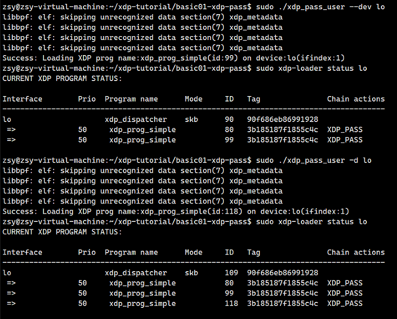
```bash
ip link list dev lo type xdp # 用于列出回环接口 (lo) 的信息，通常输出包括接口的状态（如是否启用）、MAC 地址、MTU（最大传输单元）等
bpftool net list dev lo # 列出与回环接口 lo 相关的 BPF 程序。
xdp-loader status lo # 查看 XDP 程序详细状态
```
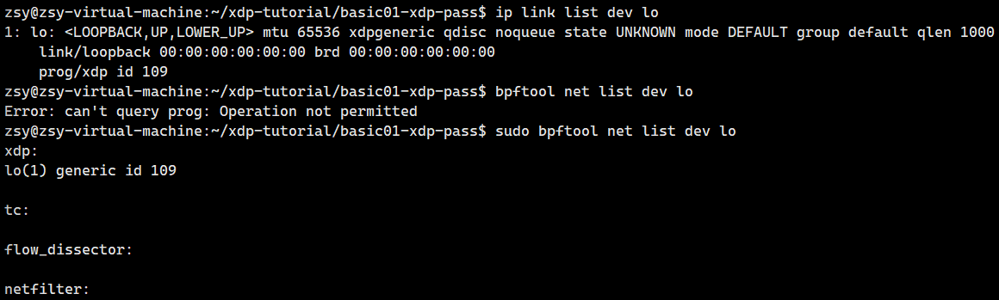
```bash
sudo ./xdp_pass_user --dev lo -U 745 # 运行用户空间程序，测试 XDP 程序
```
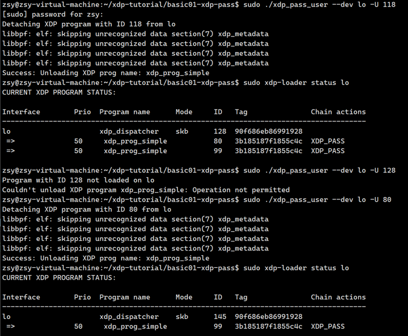
```bash
 sudo ./xdp_pass_user --dev lo --unload-all # 卸载 XDP 程序
```
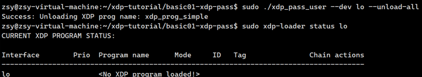

## basic02-prog-by-name

主要介绍了对于包含多个section的BPF字节码文件（obj文件），在libbpf中如何将obj文件加载到内核并根据section name选择将对应的section内核代码挂载到hook点

```bash
sudo ../testenv/testenv.sh setup --name veth-basic02  # 创建虚拟网卡
```
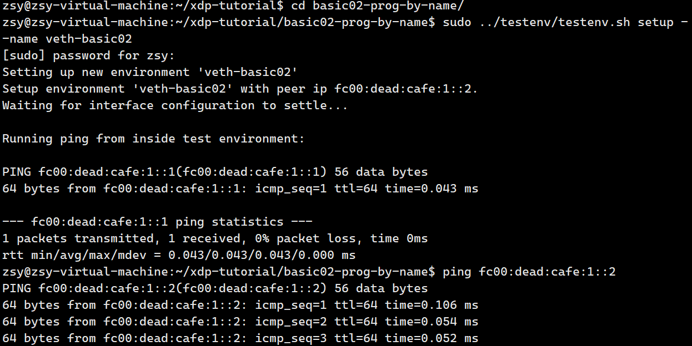
    
    2. 设置新环境
    Setting up new environment 'veth-basic02'
    这是脚本正在设置一个新的虚拟网络环境，环境的名称为 veth-basic02。
    3. 分配 IPv6 地址
    Setup environment 'veth-basic02' with peer ip fc00:dead:cafe:1::2.
    在创建的虚拟网络环境中，分配了一个IPv6地址 fc00:dead:cafe:1::2，它将作为一个节点的地址。
    4. 等待接口配置
    Waiting for interface configuration to settle...
    脚本正在等待网络接口的配置完成并稳定下来。此步骤确保网络环境在后续测试前已经准备好。
    5. 运行 ping 测试
    Running ping from inside test environment:
    PING fc00:dead:cafe:1::1(fc00:dead:cafe:1::1) 56 data bytes
    64 bytes from fc00:dead:cafe:1::1: icmp_seq=1 ttl=64 time=0.055 ms
    在测试环境内部，脚本尝试通过 ping 命令与地址 fc00:dead:cafe:1::1 进行通信。这表明该地址是另一个虚拟环境中的节点。
    64 bytes from fc00:dead:cafe:1::1 表示从该目标地址返回了数据包，且数据包大小为64字节。
    icmp_seq=1 表示这是第一个 ICMP 请求。
    ttl=64 表示数据包的生存时间（Time To Live），它被设置为64，表示该数据包可以经过64跳。
    time=0.055 ms 表示往返时间（RTT），即数据包从源主机发送到目标主机并返回所需的时间，约为0.055毫秒。
    6. ping 统计信息
    --- fc00:dead:cafe:1::1 ping statistics ---
    1 packets transmitted, 1 received, 0% packet loss, time 0ms
    rtt min/avg/max/mdev = 0.055/0.055/0.055/0.000 ms
    这部分提供了 ping 测试的统计信息：
    1个数据包被发送，1个数据包成功接收，丢包率为 0%。
    往返时间（RTT）：
    最小时间（min）为 0.055 毫秒
    平均时间（avg）为 0.055 毫秒
    最大时间（max）为 0.055 毫秒
    标准偏差（mdev）为 0.000 毫秒，这表明延迟非常稳定。
```bash
ping fc00:dead:cafe:1::2 # 进行连通性测试
sudo ./xdp_loader --help # 查看帮助
```
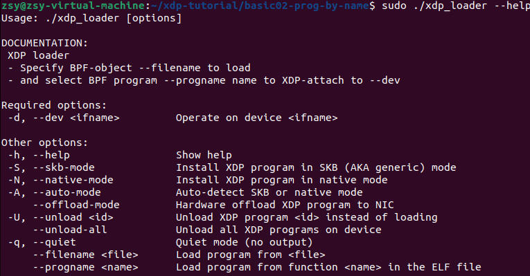
    
    文档说明：

    XDP加载器

    指定BPF对象 --filename 来加载
    并选择BPF程序 --progname 名称，附加到XDP --dev 设备上
    必选项：

    -d, --dev <ifname> 操作设备 <ifname>
    其他选项：

    -h, --help 显示帮助
    -S, --skb-mode 在SKB模式（即通用模式）下安装XDP程序
    -N, --native-mode 在原生模式下安装XDP程序
    -A, --auto-mode 自动检测SKB模式或原生模式 --offload-mode 将XDP程序卸载到网卡硬件
    -U, --unload <id> 卸载XDP程序 <id>，而不是加载 --unload-all 卸载设备上的所有XDP程序
    -q, --quiet 静默模式（无输出） --filename <file> 从 <file> 文件加载程序 --progname <name> 从ELF文件中的函数 <name> 加载程序
```bash
sudo ./xdp_loader --dev veth-basic02
sudo ./xdp_loader --dev veth-basic02 --unload-all # 卸载 XDP 程序
sudo ./xdp_loader --dev veth-basic02 --progname xdp_drop_func # 加载 XDP 程序
sudo ./xdp_loader --dev veth-basic02 --progname xdp_pass_func # 加载 XDP 程序
```
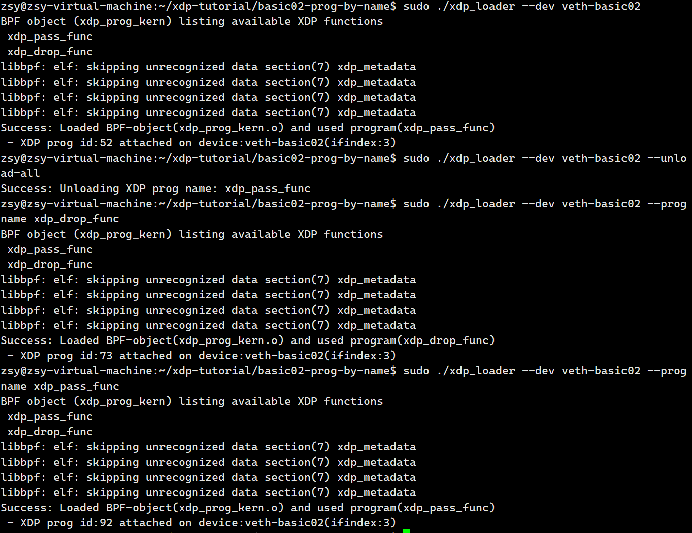

```bash
sudo ip netns exec veth-basic02 /bin/bash #手动进入命名空间
sudo ../testenv/testenv.sh enter --name veth-basic02 #用脚本自动进入命名空间
ping fc00:dead:cafe:1::1 #进行连通性测试
sudo ../testenv/testenv.sh ping --name veth-basic02 #脚本 连通性
alias t='sudo /home/fedora/git/xdp-tutorial/testenv/testenv.sh' #为了更快速地访问 testenv.sh 脚本，创建一个 shell 别名
eval $(../testenv/testenv.sh alias) #创建别名
t ping #调用测试命令
```
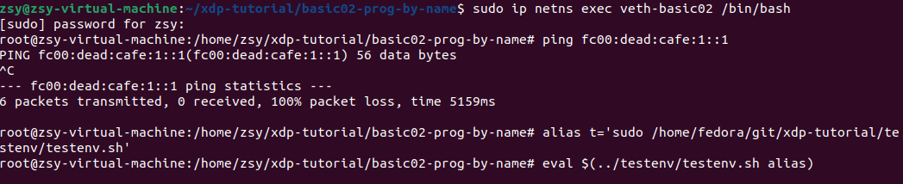
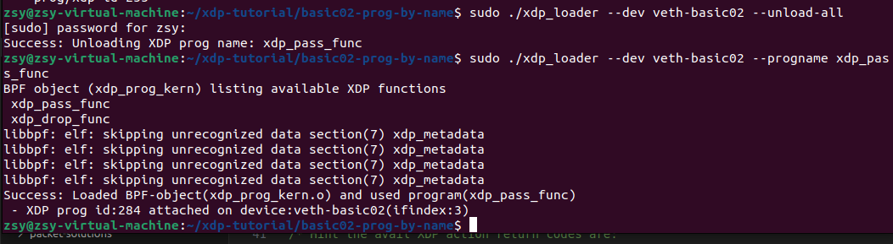
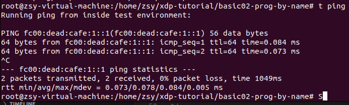

```bash
sudo ../testenv/testenv.sh status #看当前选定的环境以及所有活跃的环境 
sudo ../testenv/testenv.sh setup #创建一个新的随机名称的环境
sudo ../testenv/testenv.sh enter #进入上次使用的测试环境
sudo ../testenv/testenv.sh list #查看所有当前活跃的测试环境
sudo ../testenv/testenv.sh teardown --name <environment_name> #删除某个环境
```

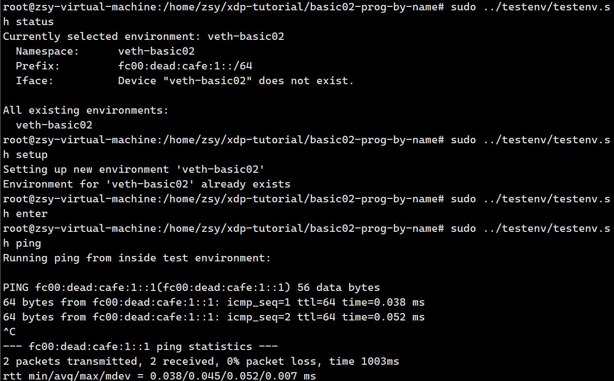


```bash
sudo ./xdp_loader --dev veth-basic02 --unload-all
sudo ./xdp_loader --dev veth-basic02 --progname xdp_abort_func
```
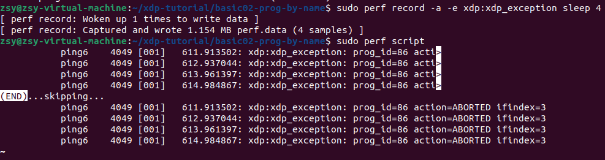

## basic03-map-counter
```bash
sudo ./xdp_load_and_stats --dev veth-basic02  xdp_stats1

sudo ./xdp_load_and_stats --dev lo  --skb-mode --progname xdp_stats1
sudo ./xdp_load_and_stats --dev lo  --unload --progname xdp_stats1

```
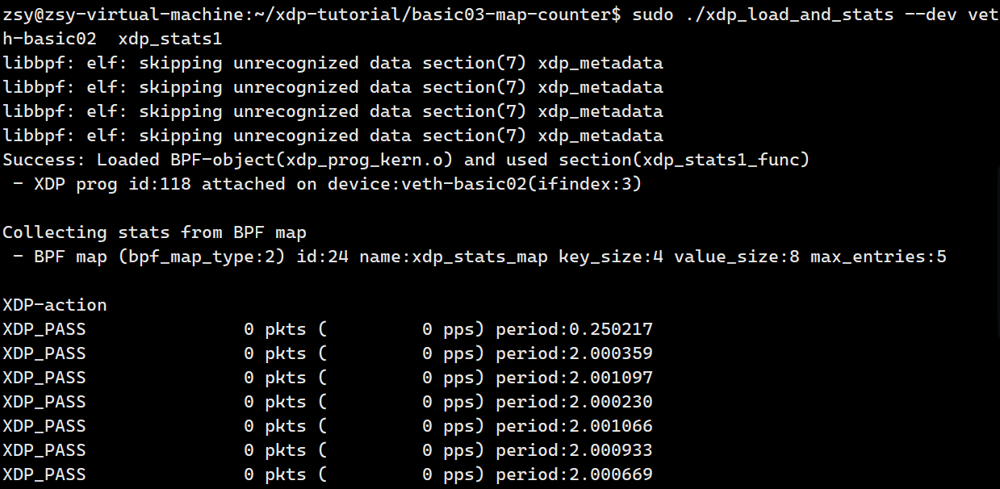

## basic04-pinning-maps
```bash
sudo ./xdp_loader --dev lo --skb-mode --progname xdp_pass_func
sudo ./xdp_loader --dev lo --unload --progname xdp_pass_func
```
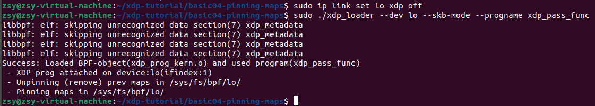
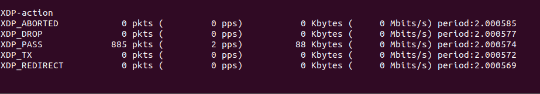