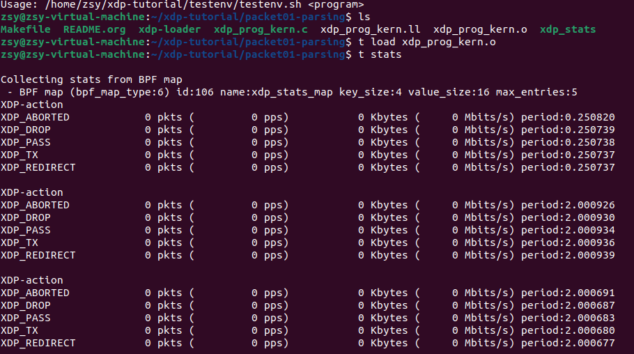
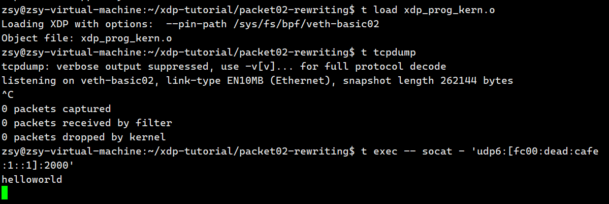
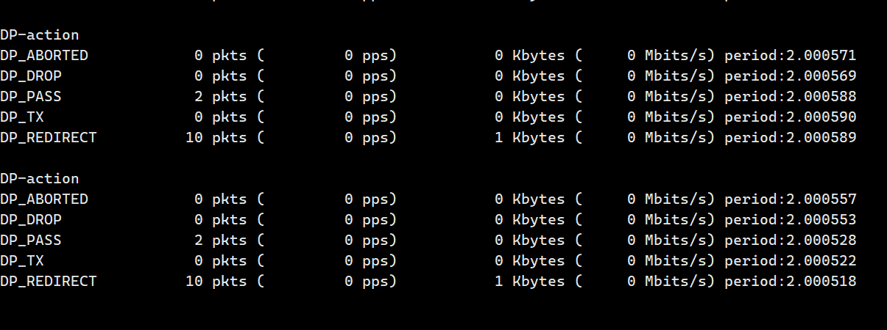

## pacakge01-parsing

```bash
sudo ../testenv/testenv.sh setup --name veth-basic02  # 创建虚拟网卡
sudo ../testenv/testenv.sh enter --name veth-basic02
ping fc00:dead:cafe:1::1 #进行连通性测试
alias t='sudo /home/fedora/git/xdp-tutorial/testenv/testenv.sh' #为了更快速地访问 testenv.sh 脚本，创建一个 shell 别名
eval $(../testenv/testenv.sh alias) #创建别名
t ping #调用测试命令

t load 
t stats

```
    
    t 命令 需要在外部环境执行，t load xdp_prog_kern.o 加载内核模块，t stats 查看统计信息向ipv4地址只能发ipv4报文，向ipv6地址只能发ipv6报文。

    从内部必须  ping6 -c 10 fc00:dead:cafe:1::1能被识别，从内部ping6 -c 10 fc00:dead:cafe:1::2 xdp程序没有识别

    从外部必须  ping6 -c 10 fc00:dead:cafe:1::2能被识别，从外部ping6 -c 10 fc00:dead:cafe:1::1 xdp程序没有识别
    


t stats展示




## pacakge02-rewritting


```bash
$ t exec -- socat - 'udp6:[fc00:dead:cafe:1::1]:2000'

```



```bash
t tcpdump
```


```bash
sudo tcpdump -i veth-basic02 -nn -xx udp port 1999
```


## pacakge02-redrecting

